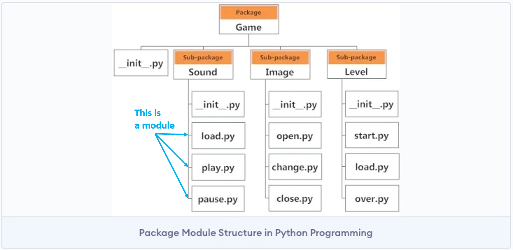

#### What are Module and Package?
>#### **Module** 
**Python files** with a `.py` extension. The name of the module is the same as the file name.   
A Python module can have a set of functions, classes, or variables defined and implemented.

>#### **Package**
==Packages are namespaces containing multiple packages and modules.==  
They're just **directories** which MUST contain a special file called `__init__.py`.  
The `__init__.py` file, **which can be empty**, indicates that the directory it's in is a Python package. That way it can be imported the same way as a module.



#### Methods to import modules

>#### KEY1 -  `import` searches for `.py` file with the same name

Modules are imported from other modules using the `import` command.   
When the `import draw` directive runs, ==the Python interpreter looks for a file in the directory in which the script was executed with the module name and a `.py` suffix.==  
In this case it will look for `draw.py`. If it is found, it will be imported. If it's not found, it will continue looking for built-in modules.

>#### KEY2 - module will only be initialized once
The first time a module is loaded into a running Python script, it is initialized by executing the code in the module once. ==If another module in your code imports the same module again, it will not be loaded again==, so local variables inside the module act as a "singleton," meaning they are initialized only once.

>#### KEY3 - a `.pyc` file is created when importing a module
When importing a module, a `.pyc` file is created. This is a compiled Python file.   
==Python compiles files into Python bytecode so that it won't have to parse the files each time modules are loaded. If a `.pyc` file exists, it gets loaded instead of the `.py` file.==
This process is transparent to the user.

>#### The code example
##### The main program: game.py
```
import draw

def play_game():
    ...

def main():
    

    result = play_game()
    draw.draw_game(result)

# this means that if this script is executed, 
# then main() will be executed
if __name__ == '__main__':
    main()
```

##### The module being imported: draw.py
```
def draw_game():
    ...

def clear_screen(screen):
    ...
```
>#### KEY4 - 4 ways to import a funtion from the module `draw`
1. `import draw` : To use the function `draw_game` from the draw module, we need to specify in which module the function is implemented, using the dot operator.Then call `draw.draw_game()`.
2. `from draw import draw_game` : The advantages of this notation is that you don't have to reference the module over and over. Just call `draw_game` directly in your main program.
3. `from draw import *`: This imports all the objects in a module.
4. `import pandas as pd`: Modules may be loaded under any name you want. This is useful when importing a module conditionally to use the same name in the rest of the code.

>#### KEY5 - Tell python where to search for module
```
# Method 1
PYTHONPATH=/foo python game.py
# Method 2
sys.path.append("/foo")
```

>#### KEY6 - Useful function `dir` and `help`
We can look for which functions are implemented in each module by using the `dir` function.  
When we find the function in the module we want to use, we can read more about it with the `help` function

>#### KEY7 -  `if __name__ == "__main__":`
To simplify, `__name__` is the name of a file, or a module.
The `__name__` variable will be assigned different value by the following condition:
1. As the file is executed as main program directly `__name__` = `__main__`
2. While, when the file is importrd by other code, `__name__` becomes `the name of the file`

Put the code under `if __name__ == "__main__":`, then you can seperate some part of code which you don't want to execute when the module is imported.

```
# ======Code Example======
# <tool.py>
# this will show when being imported and executed as main program
print(f"tool.py __name__: {__name__}")

def func1():
    print("In func1")

def func2():
    print("In func2")

# this will only show when being executed as main program
if __name__ == "__main__":
    print("in tool.py")
```
>#### KEY8 -  What is `__init__.py` for?[^1]
##### The code structure
```
mypackage/
    __init__.py
    module1.py
    module2.py
    ...
```
If you want to import module1 from mypackage, you can do so using the following import statement:
`import mypackage.module1`

When you run this import statement, Python will execute the code in `__init__.py` before it executes the import statement for `module1`. This can be useful if you want to do some initialization or setup before the other modules in the package are imported. 

---
Reference: [Basic1](https://www.learnpython.org/en/Modules_and_Packages), [Basic2](https://datasciocean.tech/python-tutorial/python-if-name-equal-main-explain/), [Basic3](https://datasciocean.tech/python-tutorial/python-package-and-module-explain/), [Basic4](https://www.learncodewithmike.com/2020/01/python-module-and-package.html
)
[^1]: [ref link: What is \_\_init\_\_.py for? ](https://betterstack.com/community/questions/what-is-init-py-for/)
